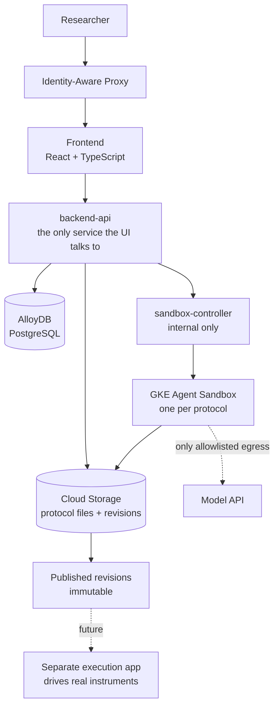

# Protocol Workcell Platform — Design Proposal

**Status:** For review
**Date:** 19 August 2026
**Author:** Bhargav
**Detail:** [`adr/`](adr/) (five ADRs) · [`specs/schema.sql`](specs/schema.sql)

---

## Summary

A collaborative web platform where researchers author liquid-handling protocols
by prompting an AI coding agent, simulate them, and share their work with
colleagues.

Each protocol is developed inside an isolated sandbox running the Antigravity
SDK. Researchers describe what they want in natural language; the agent writes
and edits PyLabRobot code; the researcher reviews it, edits directly where they
prefer, and simulates. When a protocol is ready, they publish an immutable
revision.

**This platform authors and simulates. It does not drive hardware.** A separate
application — built later, with its own safety checks — will consume published
revisions and execute them against physical instruments. That boundary is
deliberate and shapes several decisions below.

---

## The core model

Two concepts, and the distinction between them matters:

| | What it is | Why |
|---|---|---|
| **Workcell** | A named group of protocols. **The sharing boundary.** | Researchers collaborate on bodies of related work, not single files. Inviting someone per-protocol would be tedious and would fragment permissions. |
| **Protocol** | One isolated workspace: one sandbox, one storage prefix. | The agent executes generated code. Isolation must be per-unit-of-work, and the blast radius of anything going wrong must be one protocol. |

You invite people to a **workcell**. Access to a workcell grants access to every
protocol inside it, subject to role.

Protocols are nested under their workcell in storage. This is what lets a future
"protocol B reads a file protocol A produced" feature become a permissions grant
rather than a data migration.

**Roles:** `owner` · `editor` · `viewer`.

The non-obvious rule: **a viewer cannot send a chat prompt.** Prompting causes
the agent to modify files, so a viewer who can chat is an editor with extra
steps.

---

## What a researcher does

1. Opens a workcell — theirs, or one shared with them.
2. Creates a protocol and describes what they want in plain language.
3. The sandbox provisions (sub-second, from a warm pool) and the agent starts
   working. Files appear in the tree as it writes them.
4. They read the code, edit it directly where they prefer, and save. The agent
   is told about every manual edit, so it never works from stale assumptions.
5. They simulate. They iterate.
6. When it's ready, they **publish a revision** — an immutable, numbered
   snapshot recording the exact files, the runtime that produced them, and the
   simulation result.
7. They invite a colleague to the workcell. That colleague can browse every
   protocol in it, and watch the agent work live.

---

## Architecture

| Component | Responsibility |
|---|---|
| `frontend` | React + TypeScript. Workcell list → workcell detail → protocol workspace. |
| `backend-api` | The only service the UI talks to. Authorization, CRUD, sandbox orchestration triggers, proxying to sandboxes. Holds the sole GCP-facing service account. |
| `sandbox-controller` | Internal only. Manages sandbox lifecycle in the cluster. Kept separate so slow provisioning never blocks fast UI requests. |
| `sandbox-runtime` | The sandbox image itself. Antigravity SDK, PyLabRobot, a thin internal API. |

**End users never hold GCP credentials.** Everything reaches Google Cloud through
`backend-api`'s service account.

---

## Key decisions and why

### Authentication — IAP, with an application `users` table

The app performs no authentication of its own. IAP is the only gate; a group
membership grants access.

Identity is keyed on the **IAP subject ID, never email**, because email
addresses get reassigned — a new hire inheriting `j.smith@` would otherwise
inherit the previous Smith's workcell access.

The `users` table is the source of truth for sharing. IAP answers "may this
person in?"; our database answers "what may they do?"

*Why not an in-app SSO layer:* two auth systems that can disagree, for no
benefit while the app is internal-only.

### Sandboxing — GKE Agent Sandbox

Each protocol gets an individually addressable, gVisor-isolated pod that holds
state across turns within a session. Warm pools make provisioning near-instant.

The agent executes model-generated code, so isolation is strict: non-root, all
Linux capabilities dropped, no host networking, **no general internet egress** —
the allowlist contains the model API endpoint and nothing else.

*Why not Cloud Run:* Cloud Run sandboxes are nested inside your own container
instance and are not independently addressable. Routing a specific protocol's
requests to the specific instance holding its sandbox is not something Cloud Run
reliably supports.

### Storage — Cloud Storage, with an atomic commit protocol

Protocol files live in Cloud Storage, nested under their workcell.

Object storage offers no atomic multi-file commit, so a flush writes a
**manifest object last**, listing every file. The manifest is the commit point: a
sandbox killed mid-flush leaves the previous manifest intact and the partial
write is simply invisible. Flushes happen on **every completed agent turn**, not
only on shutdown, because pods are evictable.

### Database — AlloyDB for PostgreSQL

Cost is not the primary constraint. Nothing in the schema depends on
AlloyDB-specific features, so the choice remains reversible.

### One driver per protocol, everyone else observes

The Antigravity harness writes to disk without locking, so two concurrent
sessions on one protocol would corrupt the workspace. One user drives.

**But the second user is blocked from working, not from looking.** They open the
protocol in read-only observer mode: full file tree, read-only editor, and the
agent's chat **streaming live**, with a banner naming the current driver.

*Why this matters:* a hard rejection would be a dead end on the product's main
screen — no explanation, no idea who holds it, no idea when it frees up. Since
file reads already work without a sandbox, observer mode costs very little and
turns an error into a feature: colleagues can watch a protocol being developed.

### Three separate locks — they are not the same thing

| Lock | Cause | What the user sees |
|---|---|---|
| **Role** | You're a viewer | Controls simply aren't there |
| **Driver** | Someone else holds this protocol | Banner naming them; you can still read and watch |
| **Turn** | The agent is mid-response | "Agent is working — editing paused" |

A user can be an editor, *and* be the driver, and still be unable to save —
because the agent is mid-turn. All three are enforced server-side; the UI
disabling a button is a convenience, never the guarantee.

### Published revisions are immutable

Publishing produces a numbered, permanent snapshot with content hashes, the
exact runtime that produced it, and the simulation result.

*Why this is non-negotiable:* a separate application will later read these
protocols and use them to move physical liquid. If what it reads is "whatever is
in the workspace right now," it can read a half-finished edit, and "which
version actually ran?" becomes unanswerable. The cost of preventing that today
is one table and one endpoint.

Publishing is also a deliberate human action — a natural checkpoint, and the
natural place for a future review or approval step to attach.

### Dependencies are fixed, for now

The sandbox ships with pinned versions and no package installation.

Requests for "package freedom" are usually **two different needs**:

- **"I need a library you don't have"** — genuinely rare, and version drift
  threatens reproducibility.
- **"I need a custom deck resource or my own helper module"** — common, and
  *not a packaging problem at all*. It's the researcher's own code.

The second is most of the demand. The plan solves it with a shared `lib/` folder
per workcell that all protocols can import from — no packaging involved. That
mechanism is the same one the future cross-protocol reference feature needs, so
it's one piece of work serving two requirements.

Two rules hold permanently: **the agent never installs packages**, and dependency
resolution never happens inside the sandbox. An agent that can pull an
arbitrary package into an environment producing hardware-driving code is a
supply-chain risk with physical consequences.

*Why not just open egress to PyPI:* it defeats the isolation model entirely and
destroys reproducibility — a protocol that worked in March would silently behave
differently in June.

---

## Deliberately out of scope

| Not building | Why |
|---|---|
| Physical instrument execution | A separate application, with its own safety checks. This platform's job is to produce a trustworthy artifact for it. |
| Cross-protocol file references | Deferred, but the storage layout already accommodates it — adding it later is a permissions change, not a migration. |
| External collaborators | Internal-only for now. Supporting external users means moving to Identity Platform; the work is confined to one function. |
| Real-time collaborative editing | Doesn't solve the actual problem. The conflict is agent-vs-user on files, which no collaborative-editing algorithm arbitrates. |
| Takeover / request-control | Expected demand once the pilot has real users. The lock design makes it straightforward to add. |

---

## Risks we're accepting

Stated plainly so they're not discovered later.

| Risk | Assessment |
|---|---|
| **Infrastructure has a standing cost floor.** Protocol compute scales to zero; the GKE cluster, AlloyDB, and the load balancer do not. | Accepted — cost is not the primary constraint. Worth stating so "scale to zero" isn't over-read. |
| **New libraries require platform-team turnaround.** | Accepted for the pilot. Must be communicated to researchers up front rather than discovered mid-experiment. |
| **Removing someone from the access group doesn't drop their live connection.** IAP doesn't re-validate established WebSockets. | Accepted at pilot scale. Revisit if data sensitivity increases. |
| **Kubernetes is the only non-serverless component**, adding operational surface. | Accepted. The sandbox interface is abstracted, so a stateless-per-turn fallback remains available at reasonable cost if operational load proves too high. |
| **Implementation is agent-driven**, which risks frontend/backend contract drift. | Mitigated by writing the API contract first and generating the TypeScript client from it. |

---

## Delivery approach

Implementation will be carried out by an Antigravity coding agent, working from
the specifications in this repository. Two practices matter more than usual
because of that:

**The API contract is written before the code.** Frontend and backend are built
by separate agents. Given prose alone, they will disagree on field names, shapes,
and error codes. An OpenAPI specification, with the TypeScript client generated
from it, makes that class of drift impossible.

**The hard parts must be testable without cloud infrastructure.** Sandbox
lifecycle, the three locks, and the hydrate/flush cycle are where real failures
will occur, and none can be tested against live GCP in CI. The build therefore
requires a fake sandbox controller, a fake object-storage server, and injectable
identity headers — otherwise we get excellent coverage of CRUD and none of
anything that matters.

The UI is TypeScript throughout, with tests.

### Status

| | |
|---|---|
| **Decided** | Auth and identity · sandbox topology · revisions and the export contract · concurrency model · runtime and dependencies |
| **Verified** | Database schema applied and constraint-tested against PostgreSQL 16 |
| **Next** | API specification, then testing strategy, then implementation |

---

## Where the detail lives

| Document | Covers |
|---|---|
| [`adr/README.md`](adr/README.md) | Decision log, reading order, deferred items with reopen triggers |
| [`adr/ADR-001`](adr/ADR-001-authentication-and-identity.md) | Authentication and identity |
| [`adr/ADR-002`](adr/ADR-002-sandbox-topology.md) | Sandbox topology, turn locking, durable event log |
| [`adr/ADR-003`](adr/ADR-003-protocol-revisions-and-export-contract.md) | Revisions and the export contract |
| [`adr/ADR-004`](adr/ADR-004-single-driver-concurrency.md) | Concurrency and observer mode |
| [`adr/ADR-005`](adr/ADR-005-runtime-profiles-and-dependencies.md) | Runtime profiles and dependencies |
| [`specs/schema.sql`](specs/schema.sql) | Data model, with rationale inline |

Each ADR states the alternatives that were weighed and why they were set aside.
**Feedback is most useful against those**, since that's where a decision could
reasonably have gone the other way.
